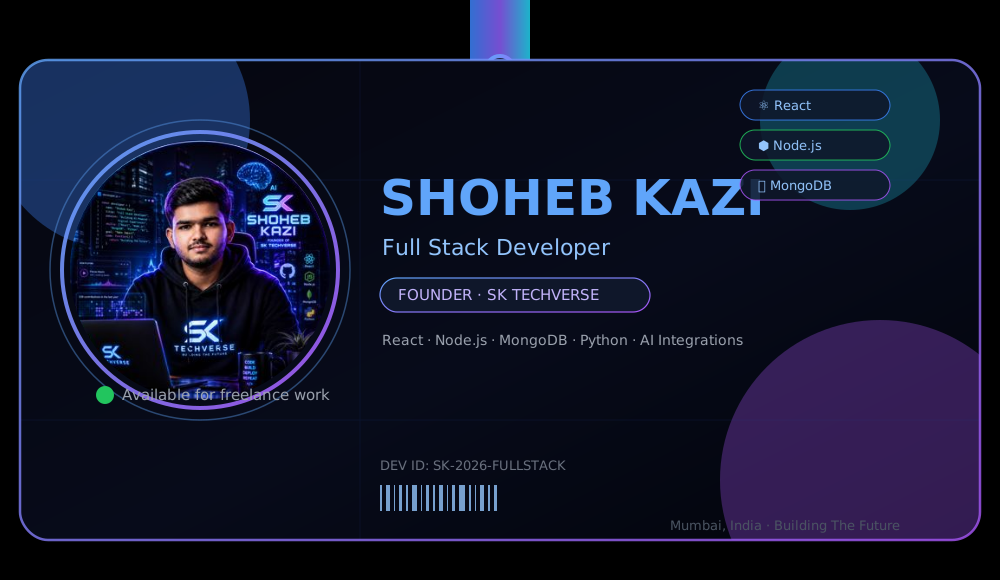
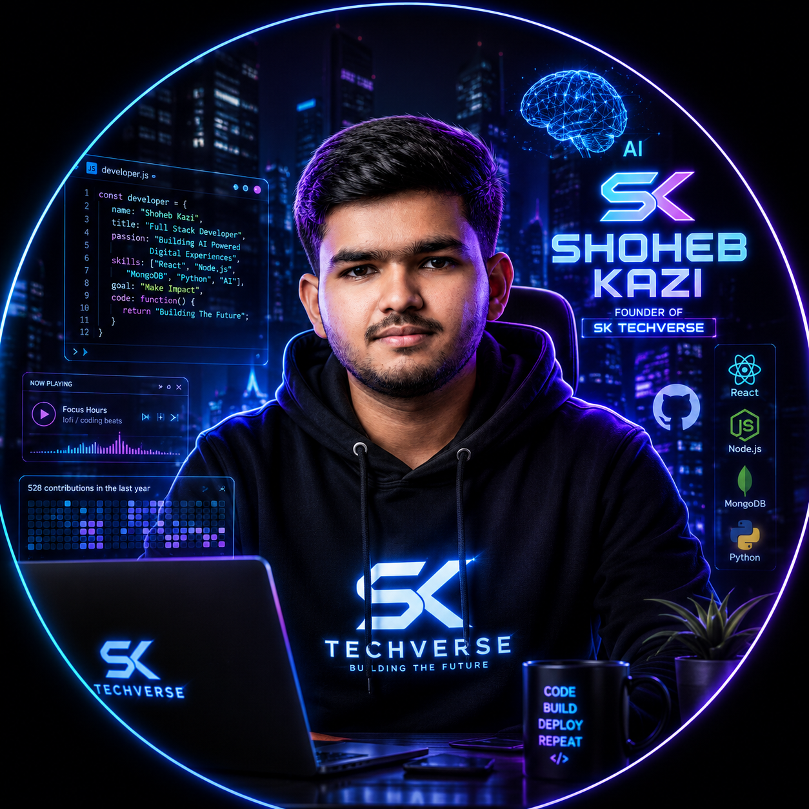

  

  

 

<table align="center">
<tr>
<td width="60%" valign="top">

### 👋 About Me

I'm **Shoheb Kazi**, a full-stack developer based in Mumbai, running my own studio, **SK TECHVERSE**. I design and ship complete, production-ready web applications — from architecture to deployment — for personal projects and clients across e-commerce, real estate, healthcare, and media.

- 🔭 Currently building enterprise platforms on the **MERN stack**
- 🎓 Pursuing my **MCA** (Master of Computer Application)
- 🎨 Obsessed with **glassmorphism, cinematic UI, and dark premium themes**
- ⚙️ From frontend polish to backend architecture — I own the full pipeline
- 📫 shoaibkazi1438@gmail.com · [sk-techverse.vercel.app](https://sk-techverse.vercel.app)

</td>
<td width="40%" valign="top" align="center">

</td>
</tr>
</table>

### 🛠️ Tech Stack

### 🚀 Featured Builds

<table align="center" width="100%">
<tr>
<td width="50%" valign="top">

**🌾 Krushi Utpadan**
Enterprise agriculture e-commerce platform built for the Indian market — full-scale MERN buildout for farmers and buyers.

`React` `Node.js` `MongoDB`

</td>
<td width="50%" valign="top">

**🏥 MediSupply Pro**
B2B medical distributor platform with role-based JWT auth, real-time order tracking via Socket.IO, and automated PDF invoicing.

`React` `Express` `Socket.IO` `PDFKit`

</td>
</tr>
<tr>
<td width="50%" valign="top">

**📱 SK Mobile Shop**
MERN-stack mobile shop management system with AI integration (Gemini/OpenAI), Redux Toolkit, and Framer Motion — 35+ backend modules.

`MERN` `Gemini API` `Redux Toolkit`

</td>
<td width="50%" valign="top">

**🎬 RMX Production**
Cinematic portfolio site for a video production brand — motion-driven, visually immersive client delivery.

`React` `GSAP` `Framer Motion`

</td>
</tr>
</table>

### 📊 GitHub Analytics

### 📈 Activity Graph

### 🐍 Contribution Snake

Live snake animation eating the contribution graph — Actions setup below ⬇️

### 🏆 Trophy Showcase

### 💭 Quote of the Moment

Refreshes with a new quote on every visit

### 🌐 Connect

  

<i>"I don't just build websites — I build brands."</i>

  

