  

<i>Building AI Powered Digital Experiences for Modern Businesses.</i>

  

 

 

## 🛠️ Tech Stack

**Languages**
 

 

**Frontend**
 

  

**Backend & Database**
 

 

**Tools**
 

[SK TechVerse Portfolio](https://sk-techverse.vercel.app) · [MediSupply Pro](#) · [SK Mobile Shop](#) · [Krushi Utpadan](#) · [RMX Production](#) · [AK Associates](#)
Upload: assets/tech-stack.svg aur assets/featured-projects.svg assets/ folder mein.
Ab README ke saare major sections (Hero, About, Services, Tech Stack, Featured Projects, Journey, Analytics) custom animated SVG panels mein convert ho chuke hain — poora background 100% dark guaranteed rahega chahe viewer light mode mein ho ya dark. Chaho to main ab pura final README.md ek single file mein assemble kar doon sab kuch already wired ke sath?Tech stackImage · SVG Featured projectsImage · SVG tech stack me yese tool dikhne chhaiyeDeliberated embedding real brand icons versus markdown approachDeliberated embedding real brand icons versus markdown approachSamajh gaya — tumhe real brand logos (colorful icon badges) chahiye, meri wali abstract dot-chips nahi. Ye jo image tumne bheji hai wo actually skillicons.dev + shields.io ke real icons hain — yehi sabse reliable aur professional dikhne wala tarika hai (custom-drawn icons se better, kyunki ye asli logos hain).
Ek cheez clear kar doon: agar main inhe apne dark custom-SVG panel ke andar embed karne ki koshish karu (jaisa maine photo ke sath kiya tha), to wahi purani problem wapas aa sakti hai (external image fetch fail). Isliye best aur guaranteed-working tarika hai inhe seedha real images ke roop mein use karna (jo GitHub natively support karta hai) — exactly jaisa tumhare screenshot mein hai.Ran a command, read a fileRan a command, read a fileYe bilkul tumhare screenshot jaisa render hoga (real HTML5, CSS3, JS, TS, PHP, Python, React, Vite, Tailwind, Node.js, Express, MongoDB, MySQL, Git, GitHub, VS Code, Figma, Postman logos + Framer Motion/Cloudinary/JWT/REST APIs badges).
README mein kya karna hai:

Purane assets/tech-stack.svg wale section () ko README se hata do
Uski jagah upar wala poora markdown block paste kar do
Ab tech-stack.svg file ki zaroorat nahi — repo mein upload mat karna

Baaki sab sections (Hero, About, Services, Featured Projects, Journey) waise hi custom dark SVG panels mein rahenge — sirf Tech Stack real-logo image style mein hoga, jo actually zyada professional aur recognizable bhi dikhta hai.Tech stack sectionDocument · MD You’ve used 90% of your session limit
Claude is AI and can make mistakes. Please double-check responses.

`React` `Three.js` `GSAP`

[Live Demo](https://sk-techverse.vercel.app) · [GitHub](https://github.com/shohebkazi)

</td>
<td width="50%" valign="top">

### 🏥 MediSupply Pro
Enterprise B2B medical distributor platform — JWT auth, Socket.IO order tracking, PDF invoicing, analytics dashboard.

`React` `Node.js` `MongoDB` `Socket.IO`

[Live Demo](#) · [GitHub](https://github.com/shohebkazi)

</td>
</tr>
<tr>
<td width="50%" valign="top">

### 📱 SK Mobile Shop
MERN mobile shop management system with AI integration (Gemini/OpenAI), Redux Toolkit, Framer Motion — 35+ backend modules.

`MERN` `Gemini API` `Redux Toolkit`

[Live Demo](#) · [GitHub](https://github.com/shohebkazi)

</td>
<td width="50%" valign="top">

### 🌾 Krushi Utpadan
Enterprise agriculture e-commerce platform for the Indian market — full-scale MERN buildout for farmers and buyers.

`React` `Node.js` `MongoDB`

[Live Demo](#) · [GitHub](https://github.com/shohebkazi)

</td>
</tr>
<tr>
<td width="50%" valign="top">

### 🎬 RMX Production
Cinematic portfolio site for a video production brand — motion-driven, visually immersive client delivery.

`React` `GSAP` `Framer Motion`

[Live Demo](#) · [GitHub](https://github.com/shohebkazi)

</td>
<td width="50%" valign="top">

### 🏠 AK Associates
Real estate brand website — clean, trust-driven presentation for property listings and client outreach.

`React` `Node.js`

[Live Demo](#) · [GitHub](https://github.com/shohebkazi)

</td>
</tr>
</table>

⚠️ Some Live Demo / GitHub links above are placeholders (`#`) — swap in the real links before publishing.

## 📈 My Journey

## 📊 GitHub Analytics

### Activity Graph

### Contribution Snake

Requires the Actions workflow — see setup notes below ⬇️

### Trophy Showcase

## 🌐 Connect

  

<i>"Code with Passion. Design with Purpose. Build the Future."</i>

  

