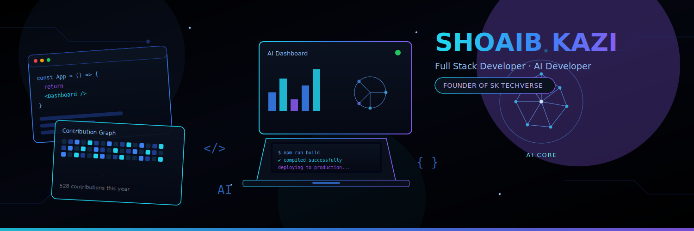
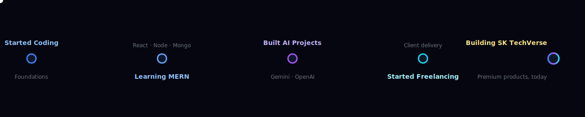

  

<i>Building AI Powered Digital Experiences for Modern Businesses.</i>

  

 

 

## 🛠️ Tech Stack

**Languages**
 

**Frontend**
 
 &nbsp;

**Backend & Database**
 

**Tools**
 
 &nbsp;  

## 🚀 Featured Projects

<table width="100%">
<tr>
<td width="50%" valign="top">

### 🚀 SK TechVerse Portfolio
Studio brand website — soft white + royal blue glassmorphism, WebGL/Three.js effects, full motion system.

`React` `Three.js` `GSAP`

[Live Demo](https://sk-techverse.vercel.app) · [GitHub](https://github.com/shohebkazi)

</td>
<td width="50%" valign="top">

### 🏥 MediSupply Pro
Enterprise B2B medical distributor platform — JWT auth, Socket.IO order tracking, PDF invoicing, analytics dashboard.

`React` `Node.js` `MongoDB` `Socket.IO`

[Live Demo](#) · [GitHub](https://github.com/shohebkazi)

</td>
</tr>
<tr>
<td width="50%" valign="top">

### 📱 SK Mobile Shop
MERN mobile shop management system with AI integration (Gemini/OpenAI), Redux Toolkit, Framer Motion — 35+ backend modules.

`MERN` `Gemini API` `Redux Toolkit`

[Live Demo](#) · [GitHub](https://github.com/shohebkazi)

</td>
<td width="50%" valign="top">

### 🌾 Krushi Utpadan
Enterprise agriculture e-commerce platform for the Indian market — full-scale MERN buildout for farmers and buyers.

`React` `Node.js` `MongoDB`

[Live Demo](#) · [GitHub](https://github.com/shohebkazi)

</td>
</tr>
<tr>
<td width="50%" valign="top">

### 🎬 RMX Production
Cinematic portfolio site for a video production brand — motion-driven, visually immersive client delivery.

`React` `GSAP` `Framer Motion`

[Live Demo](#) · [GitHub](https://github.com/shohebkazi)

</td>
<td width="50%" valign="top">

### 🏠 AK Associates
Real estate brand website — clean, trust-driven presentation for property listings and client outreach.

`React` `Node.js`

[Live Demo](#) · [GitHub](https://github.com/shohebkazi)

</td>
</tr>
</table>

⚠️ Some Live Demo / GitHub links above are placeholders (`#`) — swap in the real links before publishing.

## 📈 My Journey

## 📊 GitHub Analytics

### Activity Graph

### Contribution Snake

Requires the Actions workflow — see setup notes below ⬇️

### Trophy Showcase

## 🌐 Connect

  

<i>"Code with Passion. Design with Purpose. Build the Future."</i>

  

